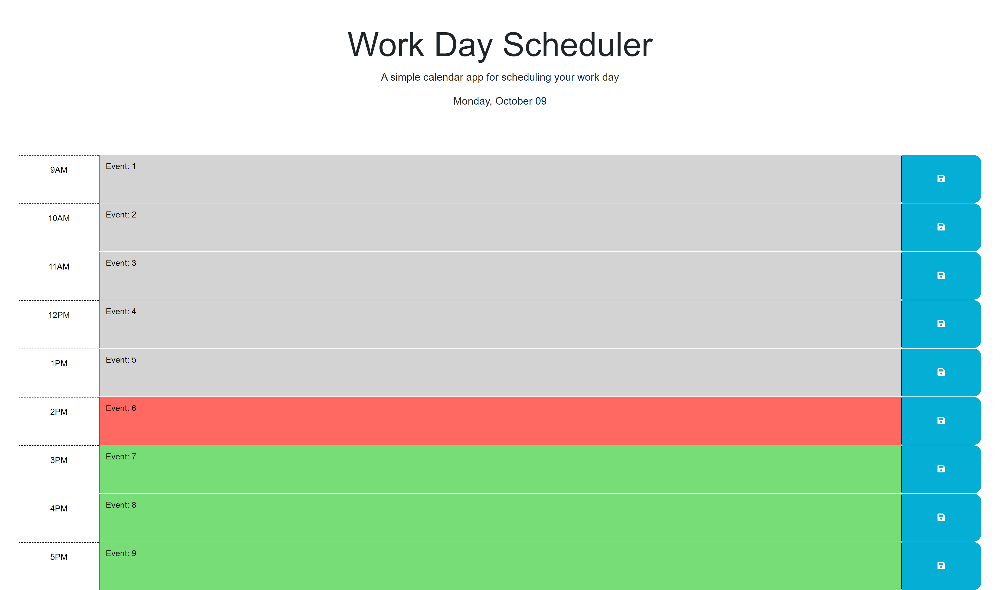

# work-day-scheduler

## Description

The purpose of this project was to create a work day scheduler application in which the user is able to save events/ tasks for each hour of a typical 9-5 work day. This app was created from starter HTML/ CSS code and runs using added modifications and jQuery functions. 

## Tasks Completed

- created a jQuery function that runs after all elements on the page has been loaded
- used Day.js to display the current day and date at the top of the page
- used Day.js to create a variable of the current hour in a day
- added an event listener onto the save buttons which allows content to be saved in local storage
- incorporated a function which adds a class to each time-block, color coding them according to what the current hour is
- used jQuery to display the saved contents of each time-block from local storage

## Links

Deployed Website:

GitHub Code Repository:

## Installation

Deploy repository containing index.html, README.md, and assets folder (containing CSS, JS and image files) to a web server.

## Usage

The deployed application can be viewed through a desktop or mobile web browser. For each time-block, the user may input and save either text or blank content by clicking the save button pertaining to it. The information is then stored in local storage and is displayed upom page refresh or until the text content is change. 

The following image shows the up to date appearance and functionality of the Work Day Scheduler:

## Credits
- Instructional Staff at the University of Minnesota Coding Bootcamp
- MDN Web Docs
- Day.js.org
- jquery.com

## License

MIT License

Copyright (c) 2023 Nainoa Dinson

Permission is hereby granted, free of charge, to any person obtaining a copy
of this software and associated documentation files (the "Software"), to deal
in the Software without restriction, including without limitation the rights
to use, copy, modify, merge, publish, distribute, sublicense, and/or sell
copies of the Software, and to permit persons to whom the Software is
furnished to do so, subject to the following conditions:

The above copyright notice and this permission notice shall be included in all
copies or substantial portions of the Software.

THE SOFTWARE IS PROVIDED "AS IS", WITHOUT WARRANTY OF ANY KIND, EXPRESS OR
IMPLIED, INCLUDING BUT NOT LIMITED TO THE WARRANTIES OF MERCHANTABILITY,
FITNESS FOR A PARTICULAR PURPOSE AND NONINFRINGEMENT. IN NO EVENT SHALL THE
AUTHORS OR COPYRIGHT HOLDERS BE LIABLE FOR ANY CLAIM, DAMAGES OR OTHER
LIABILITY, WHETHER IN AN ACTION OF CONTRACT, TORT OR OTHERWISE, ARISING FROM,
OUT OF OR IN CONNECTION WITH THE SOFTWARE OR THE USE OR OTHER DEALINGS IN THE
SOFTWARE.